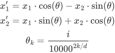
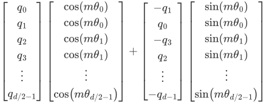
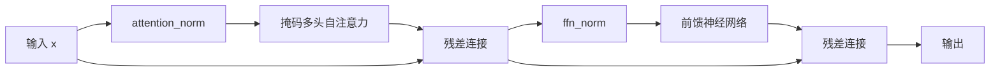
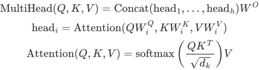
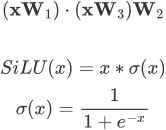
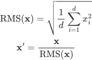
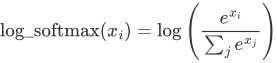
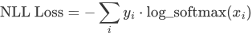
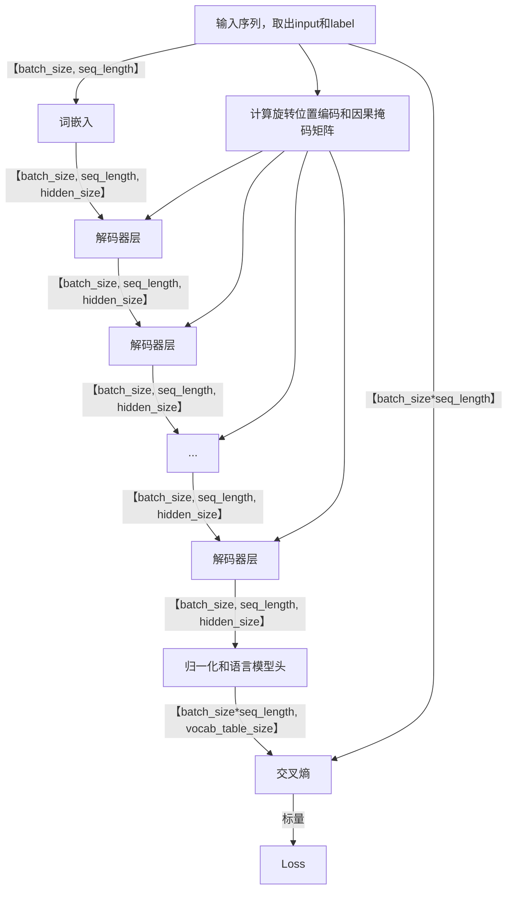

# Telechat 模型解读

## 模型结构

Telechat是由一系列解码器层组成的，其结构大致如下：

```
(model): TelechatModel<
  (embeddings_dropout): Dropout<keep_prob=1.0>
  (freqs_mgr): FreqsMgr<>
  (causal_mask): LowerTriangularMaskWithDynamicK<>
  (tok_embeddings): TelechatEmbedding<>
  (layers): CellList<
        TelechatDecodeLayer<
          (ffn_norm): LlamaRMSNorm<>
          (attention_norm): LlamaRMSNorm<>
          (attention): TelechatAttention<
            (wq): TelechatLinear<
              (dropout): Dropout<keep_prob=1.0>
              >
            (wk_v): TelechatLinear<
              (dropout): Dropout<keep_prob=1.0>
              >
            (wo): TelechatLinear<
              (dropout): Dropout<keep_prob=1.0>
              >
            (infer_attention): InferAttention<
              (flash_attention): FlashAttention<>
              (paged_attention_mgr): PagedAttentionMgr<>
              (rotary_embedding): InferRotaryEmbedding<>
              >
            >
          (feed_forward): TelechatFeedForward<
            (w1): TelechatLinear<
            (activation): LlamaSiLU<>
            (dropout): Dropout<keep_prob=1.0>
			  >
            (w2): TelechatLinear<
              (dropout): Dropout<keep_prob=1.0>
              >
            (w3): TelechatLinear<
              (dropout): Dropout<keep_prob=1.0>
              >
			>
		  >
         ...
         TelechatDecodeLayer<>*layer_num
         ...
		>
	(norm_out): LlamaRMSNorm<>
	>
(lm_head): Linear<>
(loss): CrossEntropyLoss<
  (_log_softmax): _LogSoftmax<>
  (_nllloss): _NLLLoss<>
 >
>
```

以下是对训练过程中每个模块的解读，默认不开use_past，不使用flash attention和 paged attention，使用MQA而不是GQA。

### 输入处理

对输入的处理包含词嵌入、因果掩码矩阵初始化和位置向量初始化等。首先需要将输入的句子根据分词器转为相应的token ids。预训练的目标是预测下一个token，因此给模型的输入是下标为[0, seq-1]的tokens，其对应的label，也就是模型预测的目标是下标为[1, seq]的tokens。

#### 词嵌入（TelechatEmbedding）

嵌入矩阵会将序列中的每个token转为长度为embedding size的向量。具体而言，嵌入矩阵是一个大小为`[vocab_table_size, embedding_size]`的矩阵，当输入是大小为`[bs, seq_length]`的token id组成的矩阵时，嵌入矩阵会根据每个token id找到其对应的嵌入向量，将他们组合并返回大小为`[bs, seq_length, embedding_size]`，这里的embedding size和后续模型的维度hidden size是相同的。

#### 掩码矩阵（causal_mask）

代码通过LowerTriangularMaskWithDynamic类来实现生成用于自回归模型中的注意力机制的三角掩码矩阵。该掩码矩阵确保在生成下一个token时，模型不能访问当前token之后的任何信息。具体来说，因果掩码是一个下三角矩阵，其中上三角部分（包括对角线）为 0，下三角部分为 1。

具体实现中，设输入为`tokens`，其形状为 `[batch_size, seq_length]`。若使用注意力掩码压缩，则直接返回预先计算好的三角掩码矩阵，否则会根据输入矩阵中`pad_token_id`的位置得到输入掩码`input_mask`，标记非填充位置为 1，填充位置为 0。随后重塑输入为形状 `[batch_size, 1, seq_length]`，得到注意力掩码`attention_mask`。接着根据参数选择是否生成动态掩码矩阵，确认三角掩码的生成方式，其形状为 `[1, seq_length, seq_length]`。然后将注意力掩码与三角掩码相乘，此时两个矩阵均被扩展为相同的形状 `[batch_size, seq_length, seq_length]`，相乘后再被1矩阵减掉，得到矩阵中01值反转的矩阵。最后扩展一个维度将形状变为 `[batch_size, 1, seq_length, seq_length]`，然后乘以一个大负数，得到最终的注意力掩码。

该掩码被运用在注意力计算中每次计算完注意力得分后与该掩码相加，通过softmax将后面的值变为0达到信息掩盖的目的。

#### 位置编码（RotaryEmbedding）

旋转位置编码（RoPE）通过旋转变换来编码序列中每个位置的信息，具有良好的外推性，广泛应用在语言模型中。其计算过程可以简单概括为：

假设词向量的维度是d，将其两两一对，分成d/2对二维向量，每对向量可表示为(x1,x2)。对每对向量定义一个角度，通过下式对每对二维向量实施旋转：



其中k是二维向量的维度索引，i是词在输入序列的位置索引，d​是词向量维度。

由于其稀疏性，设词向量为q，实际计算中可以简化为：



因此计算出每个角度值的sin和cos值，通过逐位相乘就可以完成位置编码的加入。

在代码实现中，会使用FreqsMgr类来管理和生成旋转位置嵌入的sin、cos值。首先会根据注意力头的大小`head_dim`和角度的计算方法生成长度为`head_dim/2`的频率（角度）序列。代码中提供了包括YARN、LLAMA3、PI、NTK等多种不同的外延方法来调整频率张量的生成方式，最普通的外延方法就是生成值从0到`max_position_embedidng`的序列。随后根据外延方式，频率序列与位置索引进行外积运算生成大小为`[max_position_embedding, head_dim / 2]`的频率矩阵，通过在最后一个维度拼接一次保留位置编码的实部和虚部，并做sin、cos运算，得到大小均为`[max_position_embedding, head_dim]`的sin、cos矩阵。随后每次调用FreqsMgr时，从sin、cos矩阵中取出对应seq_length长度的频率张量，大小为`[seq_length, head_dim]`，和交换矩阵一起返回。

交换矩阵是一个形状为`[head_dim, head_dim]`的矩阵，其是由四个`[head_dim / 2, head_dim / 2]`的子矩阵组成，左上角右下角是零矩阵，右上角是单位矩阵，左下角是负的单位矩阵，该矩阵的目的就是将矩阵的前半部分与后半部分交换，来使得输入能与对应的sin值对齐。

RotaryEmbedding用来给Q、K矩阵添加位置变量。传入Q、K和旋转位置编码相关变量后，如上述计算方式所述，Q和K分别与cos矩阵相乘，然后和与经过交换矩阵变换后再与sin矩阵相乘的Q、K相加，得到加上位置变量的Q、K矩阵。

### 解码器层（TelechatDecodeLayer）

解码器层的流程图如下所示：



#### 掩码多头自注意力 (TelechatAttention)

Telechat的解码器使用的是多头注意力，其中每个头使用缩放点积注意力计算，其计算公式如下：



代码中具体计算流程如下：

- 输入张量x的形状为 `[bs, seq_len, hidden_dim]`，通过W_Q、W_KV和等线性层得到Q、K、V矩阵。其中Q、K、V均被重塑为 `[bs, n_head, seq_len, head_dim]`。Q和K还需要与位置编码相加一次。
- Q与K的转置后相乘得到注意力分数score，其形状为`[bs, n_head, seq_len, seq_len]`，注意力分数在与模型维度开方的倒数相乘后与掩码矩阵相加，经过softmax函数后与V相乘，得到加权后的V矩阵，形状为`[bs, n_head, seq/1, head_dim]`。   
- 重塑注意力输出形状为`[bs, seq, hidden_dim]`，经过线性层W_O得到最终的输出，形状为 `[bs, seq_len, hidden_dim]`。

#### 前馈神经网络（TelechatFeedForward）

前馈神经网络使用的是SwiGLU激活函数，其结合了Swish的平滑性和GLU的门控机制，计算公式为：


其中x是输入向量， W 和 V 是模型的权重矩阵。

代码实现中，前馈神经网络由三层线性层组成，W_1​使用了激活函数SiLU，网络组成以及激活函数计算公式为：



具体计算流程如下：

- 输入张量x的形状为 `[bs, seq_len, hidden_dim]`，前馈神经网络的隐藏层维度为`dim`。
- 线性层W1和W3分别将输入x映射为gate和hidden，形状均为 `[bs, seq_len, dim]`
- gate和hidden相乘后经W2映射回原形状`[bs, seq_len, hidden_dim]`。

#### 残差连接

在每次计算完毕注意力和前馈神经网络后，还会把输入和计算结果进行相加、构成残差连接作为最终的输出。  

#### 均方根层归一化（LlamaRMSNorm）

RMSNorm相较于LayerNorm消除了对均值计算的依赖，仅通过输入特征的均方根(RMS)进行归一化，从而简化计算，提高效率。其实现与Llama保持一致，计算公式为：



其中d为输入的维度。实际计算中还需要在求得平均后加上一个很小的常数eps，来避免出现分母为0的情况。

在解码器中，计算注意力和前馈神经网络之前会进行一次归一化操作。此外，在经过所有解码器去层得到最终输出前还会进行一次归一化操作。

### 输出处理

输出处理包括将模型的输出映射为词并计算loss。

#### 语言模型头( lm_head )

在得到大小为``[bs, seq_len, hidden_dim]`` 的模型输出后，经过LM_Head的线性层得到大小为`[bs, seq_len, vocab_table_size]`的logits，该logits在推理时可直接返回用于后续的文本生成，也可以在训练时用来计算loss，loss的计算需要用到上述的label以及对应的有效位置input_mask。

在计算loss前需要将logits和label的shape展平，将logits的形状转为 `[batch_size * seq_length, vocab_size]`，labels的形状转为 `[batch_size * seq_length]`，input_mask形状与labels相同。

#### 交叉熵 （CrossEntropyLoss）

首先，对模型输出的logits应用log_softmax函数，将logits转换为log概率分布，



其中x_i代表模型输出logits中第i个元素。同时label会转为one-hot向量，与logits形状保持一致，均为 `[batch_size * seq_length, vocab_size]`。

然后使用NLLLoss计算log概率分布和目标标签之间的负对数似然损失：



得到形状为`[batch_size * seq_length]`的loss_reduce。

接下来，将loss_reduce与input_mask相乘后求和得到加权损失的总和，然后通过input_mask得到有效位置的总数，两者相除即为平均loss。

## 数据流程图

整个训练过程可以以如下流程图表示




