# 前言

本指引旨在华为昇腾 800T A2 上运行 TeleChat2，包含了相关素材的获取、环境的准备、模型的简单推理和微调。

# 环境准备

## 驱动固件环境准备

登陆服务器并查看固件驱动版本

```shell
npu-smi info -t board -i 0
npu-smi info
```

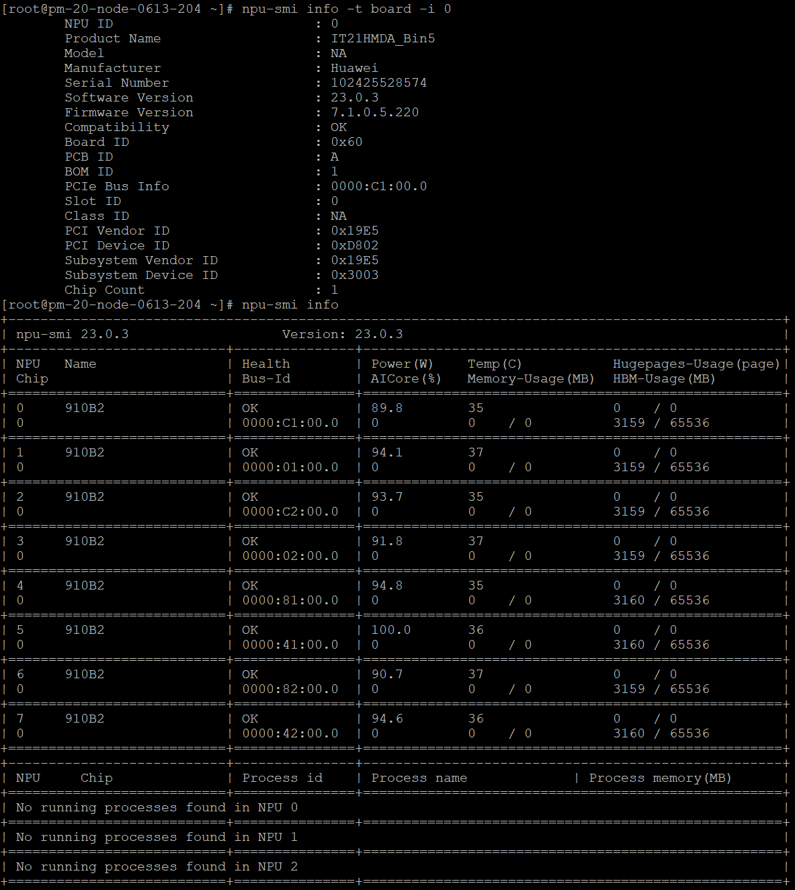

若未安装过相关驱动或固件则提示无此命令

### 安装驱动固件

**安装包地址：**[Ascend-hdk-910b-npu_23.0.3_linux-aarch社区版](https://ascend-repo.obs.cn-east-2.myhuaweicloud.com/Ascend%20HDK/Ascend%20HDK%2023.0.3/Ascend-hdk-910b-npu_23.0.3_linux-aarch64.zip?response-content-type=application/octet-stream)

> 下载上方的压缩包后，使用unzip直接解压
>
> 首次安装场景包括安装过驱动固件但是当前已卸载，按照 驱动 > 固件 的顺序安装
>
> 覆盖安装场景 按照 固件 > 驱动 的顺序安装

#### 前期准备

```sh
#执行如下命令增加执行权限和校验软件包的一致性和完整性。
chmod +x Ascend-hdk-910b-npu-driver_23.0.3_linux-aarch64.run
chmod +x Ascend-hdk-910b-npu-firmware_7.1.0.5.220.run
./Ascend-hdk-910b-npu-driver_23.0.3_linux-aarch64.run --check
./Ascend-hdk-910b-npu-firmware_7.1.0.5.220.run --check
#Debian系列（包含Ubuntu、Debian、UOS20、UOS20 SP1操作系统）推荐安装依赖
apt-get install -y dkms gcc 
```

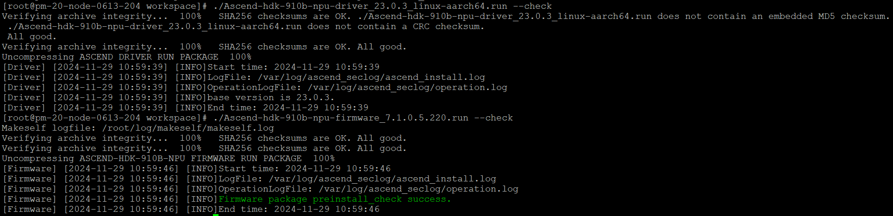

#### 从头安装驱动固件

```sh
#安装驱动
./Ascend-hdk-<chip_type>-npu-driver_<version>_linux-<arch>.run --full --install-for-all
#输出如下信息驱动安装成功：Driver package installed successfully!
#出现[ERROR]The list of missing tools: lspci,ifconfig，请安装缺少的依赖
apt-get install -y net-tools pciutils

#重启系统
reboot
#安装固件
./Ascend-hdk-<chip_type>-npu-firmware_<version>.run --full
#输出如下信息固件安装成功：Firmware package installed successfully! Reboot now or after driver installation for the installation/upgrade to take effect
#重启系统
reboot
#查看驱动加载是否成功
npu-smi info
```

### 卸载驱动固件

```sh
#卸载驱动
/usr/local/Ascend/driver/script/uninstall.sh

#卸载固件
/usr/local/Ascend/firmware/script/uninstall.sh
```

## 容器环境准备

### docker安装

```sh
dnf install -y docker runc
sudo systemctl start docker
sudo docker images
```

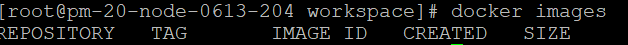

### 构建镜像

- 访问[ascend-mindspore](https://www.hiascend.com/developer/ascendhub/detail/9de02a1a179b4018a4bf8e50c6c2339e)
  选择24.0.RC1-A2-openeuler20.03版本，获取登录访问权限

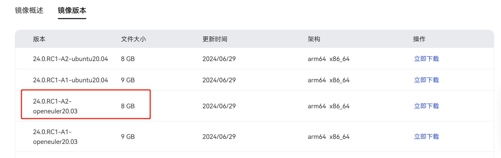

- 使用[Dockerfile_TeleChat_ms](https://github.com/Tele-AI/TeleChat2/blob/main/Dockerfile_TeleChat_ms) 搭建镜像

```sh
docker pull swr.cn-south-1.myhuaweicloud.com/ascendhub/ascend-mindspore:24.0.RC1-A2-openeuler20.03
docker build -f Dockerfile_TeleChat_ms -t telechat-ms:1.0 .
```

### 权重下载

- [telechat-7B-ms](https://telechat-docker.obs.cn-north-4.myhuaweicloud.com/model_weight/Telechat_7B/TeleChat2-7B_ms.ckpt)
- [telechat-35B-ms](https://telechat-docker.obs.cn-north-4.myhuaweicloud.com/model_weight/Telechat_35B/TeleChat2-35B_ms.tar)
- [telechat-115B-ms](https://telechat-docker.obs.cn-north-4.myhuaweicloud.com/model_weight/Telechat_115B/Telechat_115B.zip)

### 运行容器

```shell
docker run -itd -u 0 --ipc=host  --network host \
--name  telechat \
--privileged \
--device=/dev/davinci0 \
--device=/dev/davinci1 \
--device=/dev/davinci2 \
--device=/dev/davinci3 \
--device=/dev/davinci4 \
--device=/dev/davinci5 \
--device=/dev/davinci6 \
--device=/dev/davinci7 \
--device=/dev/davinci_manager \
--device=/dev/devmm_svm \
--device=/dev/hisi_hdc \
-v /usr/local/Ascend/driver:/usr/local/Ascend/driver \
-v /usr/local/Ascend/add-ons/:/usr/local/Ascend/add-ons/ \
-v /usr/local/sbin/npu-smi:/usr/local/sbin/npu-smi \
-v /usr/local/sbin/:/usr/local/sbin/ \
-v /var/log/npu/conf/slog/slog.conf:/var/log/npu/conf/slog/slog.conf \
-v /var/log/npu/slog/:/var/log/npu/slog \
-v /var/log/npu/profiling/:/var/log/npu/profiling \
-v /var/log/npu/dump/:/var/log/npu/dump \
-v /var/log/npu/:/usr/slog \
-v /data03:/mnt/model \
telechat-ms:1.0 \
/bin/bash
```

最后的模型挂载路径可以更换为本地保存模型的路径。

## 容器内环境配置

```shell
docker exec -it your_image_name bash
export PYTHONPATH=/workspace/TeleChat2/mindformers
source /usr/local/Ascend/ascend-toolkit/set_env.sh
```

验证mindspore

```sh
python -c "import mindspore;mindspore.set_context(device_target='Ascend');mindspore.run_check()"
```
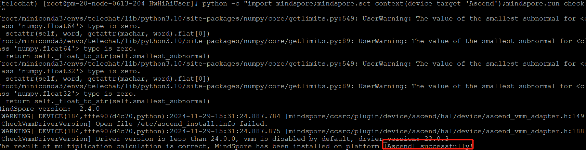

验证mindformers

```python
python -c "import mindformers;mindformers.run_check()"
```

# 模型推理

## 单卡推理

```sh
# 进入工程目录
cd /workspace/TeleChat2/mindformers/research/telechat2

# 运行推理
python3 run_telechat_predict.py --vocab_file_path tokenizer.model \
  --checkpoint_path  /mnt/model/workspace/TeleChat2-7B_ms.ckpt \
  --use_parallel False \
  --yaml_file predict_telechat_7b.yaml

# 参数说明
vocab_file_path: tokenizer文件路径
checkpoint_path: 模型权重文件路径
use_parallel: 是否使用多卡推理
yaml_file: 推理配置文件路径
```

> **说明：**\
对于推理和训练的启动命令，如果加载的权重分片数与实际使用的显卡数不同，则需要使用权重转换（比如设置 `auto_trans_ckpt` 为 True），同时修改 yaml 文件中的[并行配置](#并行配置)。此外，若转换前的权重为分布式权重（分片数大于 1 ），则转换时需要同时指定转换前的切分策略（如设置 'src_strategy_path_or_dir' 为权重对应的切分策略文件）。**下同**。

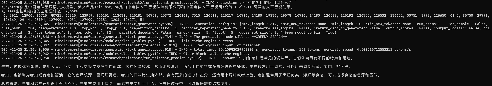

也可以自己传入输入文件推理，传入文件的参数为`--input_file`， 可以处理的格式示例：

```json
{"input": "生抽和老抽的区别？"}
{"input": "9.11和9.8哪个大"}
```

如果需要控制生成长度，可以：

1. 在配置文件中修改 max_decode_length，该参数的含义是input_prompt + max_new_tokens 的总 tokens 数量。

2. 在 `run_telechat_predict.py` 代码中调用 generate 前修改传入的 max_new_tokens。

   注意：若添加 max_new_tokens 参数，该参数会覆盖上面的 max_decode_length 参数。


如果需要获取输出的 logits 或者 scores，可以：

1. 在配置文件中设置 return_dict_in_generate 为True。

2. 设置 output_scores、output_logits 等参数为 True。

   注意：修改后返回的数据类型是词典，需要对应改一下 output 的解码过程。

## 多卡推理

```shell
cd /workspace/TeleChat2/mindformers/research/telechat2

bash msrun_launcher.sh "python3 run_telechat_predict.py \
  --vocab_file_path tokenizer.model \
  --checkpoint_path /mnt/model/workspace/TeleChat2-7B_ms.ckpt \
  --use_parallel True \
  --yaml_file predict_telechat_7b.yaml" 8
```

msrun_launcher.sh 是并行需要的启动文件，所提供的参数如下表所示：

| **参数**         | **单机是否必选** | **多机是否必选** |    **默认值**    | **说明**                         |
| ---------------- | :--------------: | :--------------: | :--------------: | -------------------------------- |
| WORKER_NUM       |     &check;      |     &check;      |        8         | 所有节点中使用计算卡的总数       |
| LOCAL_WORKER     |        -         |     &check;      |        8         | 当前节点中使用计算卡的数量       |
| MASTER_ADDR      |        -         |     &check;      |    127.0.0.1     | 指定分布式启动主节点的ip         |
| MASTER_PORT      |        -         |     &check;      |       8118       | 指定分布式启动绑定的端口号       |
| NODE_RANK        |        -         |     &check;      |        0         | 指定当前节点的rank id            |
| LOG_DIR          |        -         |     &check;      | output/msrun_log | 日志输出路径，若不存在则递归创建 |
| JOIN             |        -         |     &check;      |      False       | 是否等待所有分布式进程退出       |
| CLUSTER_TIME_OUT |        -         |     &check;      |       7200       | 分布式启动的等待时间，单位为秒   |

抓取 `output/msrun_log/` 下任意worker的日志即可查看推理结果。

## 动态外推
如果待推理数据的 `输入长度 + 生成长度 > 训练长度`，则需开启外推功能。

以 7B 模型为例，修改 `predict_telechat_7b.yaml`：

- Step 1. 修改并行模式
```yaml
parallel:
  parallel_mode: 'STAND_ALONE'
  full_batch: False
```

- Step 2. 修改模型超参
```yaml
model:
  model_config:
    seq_length: 32768
    max_position_embedding: 8192
    extend_method: 'DYNAMIC_NTK'

# 参数说明
seq_length: 模型能够推理的最大长度
max_position_embedding: 模型的预训练长度
extend_method: 开启动态外推功能
```


# 模型微调

## 处理微调数据

### 微调数据样例
```json
{"system": "你是中国电信星辰语义大模型，英文名是TeleChat，你是由中电信人工智能科技有限公司和中国电信人工智能研究院（TeleAI）研发的人工智能助手。\n", "dialog": [{"role": "user", "content": "给我推荐一本好看的小说吧。"}, {"role": "bot", "content": " 如果你喜欢历史题材，我可以向你推荐一本红楼梦。如果你喜欢奇幻题材，我可以向你推荐《哈利波特》系列或《指环王》。如果喜欢悬疑题材，我可以推荐《福尔摩斯探案全集》。请告诉我您的喜好，我可以更好地推荐适合你的小说。"}], "multiturn": false, "tool": false}
```

### 启动命令
```bash
cd /workspace/TeleChat2/mindformers/research/telechat2

python telechat_preprocess.py --input_dataset_file /workspace/TeleChat2/datas/demo_tool.jsonl --vocab_file_path ./tokenizer.model --max_length 8192 --output_path {path}/mindrecords

# 参数说明:
input_dataset_file: 数据集 jsonl 文件
vocab_file_path: 词模型文件路径
max_length: 数据集长度
output_path: 生成数据集的路径
```

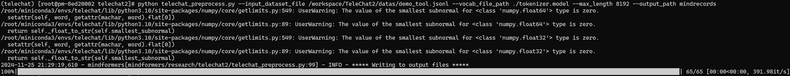

## 微调方式选择与超参配置

> 在模型训练所加载的 yaml 文件中找到对应配置并修改。

### 并行配置

根据 **服务器节点数**、**模型参数大小**、**模型上下文长度** 等信息，修改分布式策略，并需保证 `data_parallel * model_parallel * pipeline_stage * context_parallel == device_num`。

```yaml
# 配置双机 16 卡分布式策略，以 dp=8, mp=2, pp=1, cp=1 为例
parallel_config:
  data_parallel: 8
  model_parallel: 2
  pipeline_stage: 1
  context_parallel: 1 # 序列并行，长文训练时建议启用
  micro_batch_num: 1
```

### 序列长度相关超参设置

根据模型微调所需的上下文长度、预训练长度，设置相关参数。示例如下：

```yaml
model:
  model_config:
    seq_length: 32768
    pretrain_seqlen: 8192
    training_seqlen: 32768
    extend_method: "NTK"
    theta: 1000000


# 参数说明：
seq_length: 模型的微调长度
pretrain_seqlen: 所加载模型的预训练长度
training_seqlen: 模型的微调长度
extend_method: 若模型的训练长度（seq_length）大于预训练长度，则设置为 NTK，否则可以设置为 None。
theta: 旋转位置编码中计算旋转角的底数：训练 8K 模型时无需设置，默认 10000；训练 32K 模型时，建议设置为 1000000；训练 256K 模型时，建议设置为 40000000。
```

### LoRA 微调相关配置

- Step 1. 设置 `strategy_ckpt_config`

```yaml
parallel:
  strategy_ckpt_config:
    save_file: "./ckpt_strategy.ckpt"
    only_trainable_params: False # 是否仅保存可训练参数的策略信息。默认值为True。设置为False，表示在保存策略文件时生成完整的策略信息，以进行微调后合并多分片权重为单分片权重
```
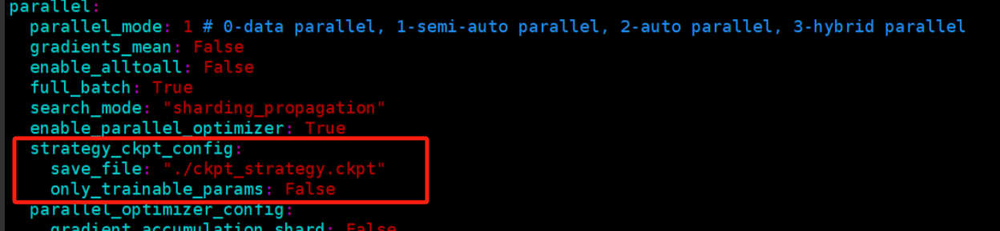

- Step 2. 设置 `pet_config`

```yaml
pet_config: 
  pet_type: lora
  lora_rank: 8
  lora_alpha: 16
  lora_dropout: 0.0
  target_modules: ".*wq|.*wk_v|.*wo"
  compute_dtype: "bfloat16"
  param_init_type: "float32"

# 参数说明：
pet_type: 指定参数微调技术（PET，Parameter-Efficient Tuning）的类型为LoRA
lora_rank: 定义了低秩矩阵的秩值。秩值越小，微调时需要更新的参数越少
lora_alpha: 控制LoRA模块中权重更新的缩放比例。这个值决定了微调过程中，权重更新的幅度和影响程度。
lora_dropout: 设置 LoRA 模块中的 dropout 概率。
target_modules: 通过正则表达式指定 LoRA 将应用于模型中的哪些权重矩阵。
```

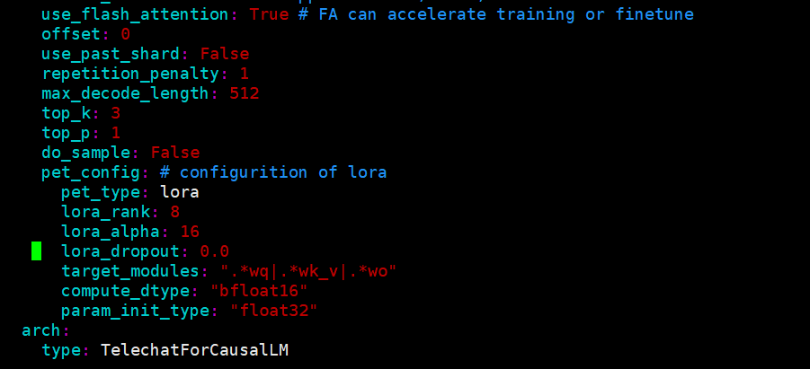


### 长文微调相关配置

- Step 1. 设置模型超参


- Step 2. Flash Attention 负载均衡优化（可选）

```yaml
# 在 context 中新增这两行即可
context:
  ascend_config: 
    parallel_speed_up_json_path: "/lgsl_data/dianxin_telechat/mindformers/research/parallel_speed_up_sp.json"
```


## 单机多卡微调

开始微调

```shell
#进入工程目录
cd /workspace/TeleChat2/mindformers

#运行微调
bash scripts/msrun_launcher.sh "python run_mindformer.py \
  --config research/telechat2/finetune_telechat_7b.yaml \
  --train_dataset {path}/mindrecords \
  --load_checkpoint /mnt/model/workspace/TeleChat2-7B_ms.ckpt \
  --use_parallel True \
  --auto_trans_ckpt True \
  --register_path research/telechat2" 8
```

当控制台出现如下日志时：

```
[mindspore/parallel/cluster/process_entity/_api.py:224] Start worker process with rank id:0, log file:output/msrun_log/worker_0.log. Environment variable [RANK_ID] is exported.
[mindspore/parallel/cluster/process_entity/_api.py:224] Start worker process with rank id:1, log file:output/msrun_log/worker_1.log. Environment variable [RANK_ID] is exported.
[mindspore/parallel/cluster/process_entity/_api.py:224] Start worker process with rank id:2, log file:output/msrun_log/worker_2.log. Environment variable [RANK_ID] is exported.
[mindspore/parallel/cluster/process_entity/_api.py:224] Start worker process with rank id:3, log file:output/msrun_log/worker_3.log. Environment variable [RANK_ID] is exported.
[mindspore/parallel/cluster/process_entity/_api.py:224] Start worker process with rank id:4, log file:output/msrun_log/worker_4.log. Environment variable [RANK_ID] is exported.
[mindspore/parallel/cluster/process_entity/_api.py:224] Start worker process with rank id:5, log file:output/msrun_log/worker_5.log. Environment variable [RANK_ID] is exported.
[mindspore/parallel/cluster/process_entity/_api.py:224] Start worker process with rank id:6, log file:output/msrun_log/worker_6.log. Environment variable [RANK_ID] is exported.
[mindspore/parallel/cluster/process_entity/_api.py:224] Start worker process with rank id:7, log file:output/msrun_log/worker_7.log. Environment variable [RANK_ID] is exported.
```

说明启动微调成功，此时抓取每个 worker 的日志可以看到训练进度。如果 pipeline_stage > 1，请以最后一个 worker 日志中的 loss 为准。

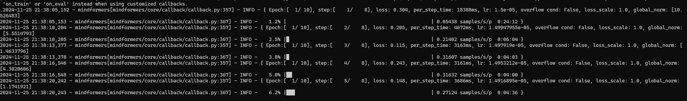

## 多机多卡微调

假设有两个服务器节点，节点 0 的 IP 为 192.168.1.1，作为主节点；节点 1 的 IP 为 192.168.1.2。每个节点 8 卡，共 16 张卡。

在每台机器上设置环境变量

```sh
#For 192.168.1.1
export SHARED_PATHS=/shared_path  # 用于保存训练权重、切分策略等文件的路径，需为共享存储，保证参与微调的机器均能访问
unset RANK_TABLE_FILE

#For 192.168.1.2
export SHARED_PATHS=/shared_path  # 用于保存训练权重、切分策略等文件的路径，需为共享存储，保证参与微调的机器均能访问
unset RANK_TABLE_FILE
```

微调之前，可以选择自动权重转换或离线权重转换。

### 自动权重转换

涉及到权重转换的详细教程请参考特性文档模型权重切分与合并。若模型权重在服务器共享盘上，可以尝试使用自动权重转换。

```sh
cd /workspace/TeleChat2/mindformers

# 节点 0，IP 为 192.168.1.1，作为主节点
bash scripts/msrun_launcher.sh "python run_mindformer.py \
 --config research/telechat2/finetune_telechat_7b.yaml \
 --load_checkpoint /mnt/model/workspace/TeleChat2-7B_ms.ckpt \
 --train_dataset {path}/mindrecords \
 --use_parallel True \
 --auto_trans_ckpt True \
 --register_path research/telechat2 "
  16 8 192.168.1.1 8118 0 output/msrun_log False 300

# 节点 1，IP 为 192.168.1.2，启动命令与主节点仅参数 NODE_RANK 不同
bash scripts/msrun_launcher.sh "python run_mindformer.py \
 --config research/telechat2/finetune_telechat_7b.yaml \
 --load_checkpoint /mnt/model/workspace/TeleChat2-7B_ms.ckpt \
 --train_dataset {path}/mindrecords \
 --use_parallel True \
 --auto_trans_ckpt True \
 --register_path research/telechat2 "
  16 8 192.168.1.1 8118 1 output/msrun_log False 300
```

### 离线权重转换

- step 1. 打开策略文件保存开关（如果已有目标切分策略文件，则 Step 1 与 Step 2 可跳过。

修改微调配置文件 `finetune_telechat_7b.yaml`，将 `only_save_strategy` 设置为True。

- step 2. 启动训练，注意关闭自动切分 `auto_trans_ckpt` 参数。

```sh
cd /workspace/TeleChat2/mindformers

# 节点 0，IP 为 192.168.1.1，作为主节点
bash scripts/msrun_launcher.sh "python run_mindformer.py \
  --config research/telechat2/finetune_telechat_7b.yaml \
  --train_dataset {path}/mindrecords \
  --use_parallel True \
  --register_path research/telechat2 " 16 8 192.168.1.1 8118 0 output/msrun_log False 300

# 节点 1，IP 为 192.168.1.2，启动命令与主节点仅参数 NODE_RANK 不同
bash scripts/msrun_launcher.sh "python run_mindformer.py \
  --config research/telechat2/finetune_telechat_7b.yaml \
  --train_dataset {path}/mindrecords \
  --use_parallel True \
  --register_path research/telechat2 " 16 8 192.168.1.1 8118 1 output/msrun_log False 300
```

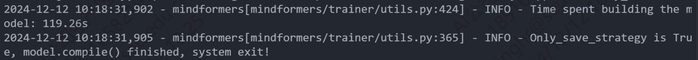

各节点的策略文件保存在各自的 `output/strategy` 目录下。

- step 3. 离线权重转换 

```sh
cd /workspace/TeleChat2/mindformers

python mindformers/tools/ckpt_transorm/transform_checkpoint.py \
--src_checkpoint /mnt/model/workspace/TeleChat2-7B_ms.ckpt \
--dst_checkpoint /mnt/model/workspace/TeleChat2-7B-2mp8dp \
--dst_strategy output/strategy
```

转换完成后在 `dst_checkpoint` 目录下生成切片权重，注意此时会根据前缀生成新一级目录。

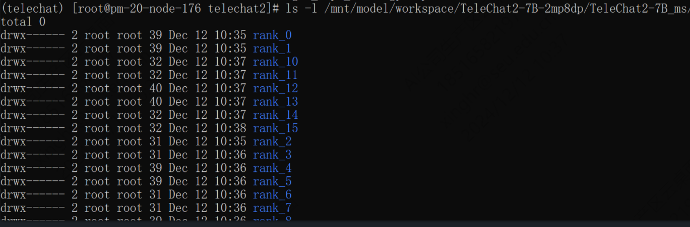

- step 4. 将配置文件修改回来

修改微调配置文件 `finetune_telechat_7b.yaml`，将 `only_save_strategy` 设置为 False。

- step 5. 启动任务，启动命令同step2，此处传入的权重路径 model_dir 应该是按照 `model_dir/rank_x/xxx.ckpt` 格式存放

```bash
cd /workspace/TeleChat2/mindformers

bash scripts/msrun_launcher.sh "python run_mindformer.py \
  --config research/telechat2/finetune_telechat_7b.yaml \
  --train_dataset {path}/mindrecords \
  --load_checkpoint /mnt/model/workspace/TeleChat2-7B-2mp8dp/TeleChat2-7B_ms \
  --use_parallel True " 16 8 192.168.1.1 8118 0 output/msrun_log False 300

bash scripts/msrun_launcher.sh "python run_mindformer.py \
  --config finetune_telechat_7b.yaml \
  --train_dataset {path}/mindrecords \
  --load_checkpoint /mnt/model/workspace/TeleChat2-7B-2mp8dp/TeleChat2-7B_ms \
  --use_parallel True " 16 8 192.168.1.1 8118 1 output/msrun_log False 300
```


## LoRA 微调权重合并

使用 LoRA 微调训练后的权重文件为根据策略切分后的权重，需要手动将切分权重合一，以用于推理。

> 前提：保存的策略文件中包括不可训练的参数（默认 LoRA 微调后策略文件中只有 LoRA 部分的参数，需要在训练 yaml 中将 only_trainable_params 参数修改为 False 进行训练）。


- step 1. 获取模型切分策略文件：

在执行微调脚本时，模型完成编译后，将会在 `output/strategy` 路径下生成各卡的切分策略文件，用于权重合并。

- step 2. 运行 `mindformers/tools/transform_ckpt_lora.py` 脚本进行多卡权重合并：

```shell
cd /workspace/TeleChat2/mindformers

python mindformers/mindformers/tools/transform_ckpt_lora.py \
--src_ckpt_strategy output/strategy/ \
--src_ckpt_path_or_dir  output/checkpoint_network/ \ 
--dst_ckpt_dir output/merge_ckpt \
--prefix telechat_7B \
--lora_scaling 2

# 参数说明
src_ckpt_strategy: 源权重对应的分布式策略文件路径，通常在启动训练任务后默认保存在 output/strategy 目录下。
src_ckpt_path_or_dir: 微调后的模型权重路径。
dst_ckpt_dir: 目标权重的保存路径，需为自定义的空文件夹路径。
dst_ckpt_strategy: 目标权重对应的切分策略，如果要将权重合一，则无需设置该参数。
prefix：合并权重文件的命名前缀，默认值为 "checkpoint_"。
lora_scaling: LoRA 权重的合并系数，默认为 lora_alpha/lora_rank，这两个参数即为 LoRA 模型配置时的参数，需自行计算。这里是16/8=2。
```
